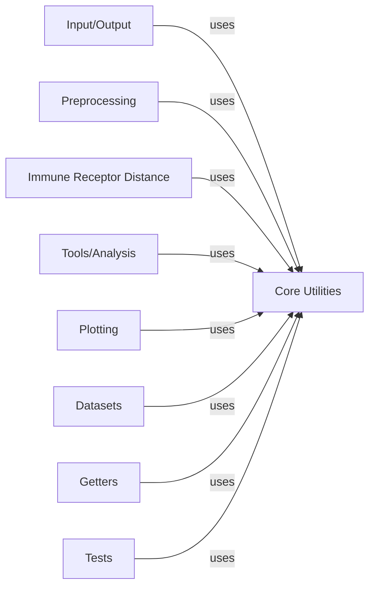

## Details

Analysis of the scirpy library components and their relationships, focusing on the central role of the Core Utilities component.

### Core Utilities [[Expand]](./Core_Utilities.md)

This foundational component provides common helper functions used across the entire `scirpy` library. This includes utilities for documentation injection, data type checks, sequence translation, parallelization, various mathematical helpers (e.g., negative binomial), and functionalities for graph creation, manipulation, and layout algorithms, particularly for clonotype networks. It acts as a support layer for all other components.

**Related Classes/Methods**:

- `scirpy.util` (1:1)

- <a href="https://github.com/scverse/scirpy/blob/main/src/scirpy/util/_negative_binomial.py#L1-L1" target="_blank" rel="noopener noreferrer">`scirpy.util._negative_binomial` (1:1)</a>

- `scirpy.util.graph` (1:1)

- <a href="https://github.com/scverse/scirpy/blob/main/src/scirpy/util/graph/_component_layout.py#L1-L1" target="_blank" rel="noopener noreferrer">`scirpy.util.graph._component_layout` (1:1)</a>

- <a href="https://github.com/scverse/scirpy/blob/main/src/scirpy/util/graph/_fr_size_aware_layout.py#L1-L1" target="_blank" rel="noopener noreferrer">`scirpy.util.graph._fr_size_aware_layout` (1:1)</a>

### Input/Output

Handles all data input and output operations, including reading and writing `AnnData` objects and other relevant data formats.

**Related Classes/Methods**:

- `scirpy.io` (1:1)

- <a href="https://github.com/scverse/scirpy/blob/main/src/scirpy/io/_convert_anndata.py#L1-L1" target="_blank" rel="noopener noreferrer">`scirpy.io._convert_anndata` (1:1)</a>

- <a href="https://github.com/scverse/scirpy/blob/main/src/scirpy/io/_datastructures.py#L1-L1" target="_blank" rel="noopener noreferrer">`scirpy.io._datastructures` (1:1)</a>

- <a href="https://github.com/scverse/scirpy/blob/main/src/scirpy/io/_io.py#L1-L1" target="_blank" rel="noopener noreferrer">`scirpy.io._io` (1:1)</a>

- <a href="https://github.com/scverse/scirpy/blob/main/src/scirpy/io/_legacy.py#L1-L1" target="_blank" rel="noopener noreferrer">`scirpy.io._legacy` (1:1)</a>

### Preprocessing [[Expand]](./Preprocessing.md)

Contains functions for preprocessing raw immune receptor sequencing data, preparing it for downstream analysis. This includes tasks like chain indexing and merging `AnnData` objects.

**Related Classes/Methods**:

- `scirpy.pp` (1:1)

- <a href="https://github.com/scverse/scirpy/blob/main/src/scirpy/pp/_index_chains.py#L1-L1" target="_blank" rel="noopener noreferrer">`scirpy.pp._index_chains` (1:1)</a>

- <a href="https://github.com/scverse/scirpy/blob/main/src/scirpy/pp/_merge_adata.py#L1-L1" target="_blank" rel="noopener noreferrer">`scirpy.pp._merge_adata` (1:1)</a>

### Immune Receptor Distance

Implements algorithms for calculating distances between immune receptors, crucial for identifying similar clonotypes.

**Related Classes/Methods**:

- `scirpy.ir_dist` (1:1)

- <a href="https://github.com/scverse/scirpy/blob/main/src/scirpy/ir_dist/_clonotype_neighbors.py#L1-L1" target="_blank" rel="noopener noreferrer">`scirpy.ir_dist._clonotype_neighbors` (1:1)</a>

- <a href="https://github.com/scverse/scirpy/blob/main/src/scirpy/ir_dist/metrics.py#L1-L1" target="_blank" rel="noopener noreferrer">`scirpy.ir_dist.metrics` (1:1)</a>

### Tools/Analysis

Provides a suite of analytical tools for immune repertoire analysis, including clonotype expansion, diversity metrics, and repertoire overlap.

**Related Classes/Methods**:

- `scirpy.tl` (1:1)

- <a href="https://github.com/scverse/scirpy/blob/main/src/scirpy/tl/_chain_qc.py#L1-L1" target="_blank" rel="noopener noreferrer">`scirpy.tl._chain_qc` (1:1)</a>

- <a href="https://github.com/scverse/scirpy/blob/main/src/scirpy/tl/_clonal_expansion.py#L1-L1" target="_blank" rel="noopener noreferrer">`scirpy.tl._clonal_expansion` (1:1)</a>

- <a href="https://github.com/scverse/scirpy/blob/main/src/scirpy/tl/_clonotype_imbalance.py#L1-L1" target="_blank" rel="noopener noreferrer">`scirpy.tl._clonotype_imbalance` (1:1)</a>

- <a href="https://github.com/scverse/scirpy/blob/main/src/scirpy/tl/_clonotype_modularity.py#L1-L1" target="_blank" rel="noopener noreferrer">`scirpy.tl._clonotype_modularity` (1:1)</a>

- <a href="https://github.com/scverse/scirpy/blob/main/src/scirpy/tl/_clonotypes.py#L1-L1" target="_blank" rel="noopener noreferrer">`scirpy.tl._clonotypes` (1:1)</a>

- <a href="https://github.com/scverse/scirpy/blob/main/src/scirpy/tl/_convergence.py#L1-L1" target="_blank" rel="noopener noreferrer">`scirpy.tl._convergence` (1:1)</a>

- <a href="https://github.com/scverse/scirpy/blob/main/src/scirpy/tl/_diversity.py#L1-L1" target="_blank" rel="noopener noreferrer">`scirpy.tl._diversity` (1:1)</a>

- <a href="https://github.com/scverse/scirpy/blob/main/src/scirpy/tl/_group_abundance.py#L12-L55" target="_blank" rel="noopener noreferrer">`scirpy.tl._group_abundance` (12:55)</a>

- <a href="https://github.com/scverse/scirpy/blob/main/src/scirpy/tl/_ir_query.py#L1-L1" target="_blank" rel="noopener noreferrer">`scirpy.tl._ir_query` (1:1)</a>

- <a href="https://github.com/scverse/scirpy/blob/main/src/scirpy/tl/_mutational_load.py#L1-L1" target="_blank" rel="noopener noreferrer">`scirpy.tl._mutational_load` (1:1)</a>

- <a href="https://github.com/scverse/scirpy/blob/main/src/scirpy/tl/_repertoire_overlap.py#L1-L1" target="_blank" rel="noopener noreferrer">`scirpy.tl._repertoire_overlap` (1:1)</a>

- <a href="https://github.com/scverse/scirpy/blob/main/src/scirpy/tl/_spectratype.py#L1-L1" target="_blank" rel="noopener noreferrer">`scirpy.tl._spectratype` (1:1)</a>

### Plotting

Offers a comprehensive set of plotting functionalities for visualizing immune repertoire data and analysis results.

**Related Classes/Methods**:

- `scirpy.pl` (1:1)

- <a href="https://github.com/scverse/scirpy/blob/main/src/scirpy/pl/_clonal_expansion.py#L1-L1" target="_blank" rel="noopener noreferrer">`scirpy.pl._clonal_expansion` (1:1)</a>

- <a href="https://github.com/scverse/scirpy/blob/main/src/scirpy/pl/_clonotype_imbalance.py#L1-L1" target="_blank" rel="noopener noreferrer">`scirpy.pl._clonotype_imbalance` (1:1)</a>

- <a href="https://github.com/scverse/scirpy/blob/main/src/scirpy/pl/_clonotypes.py#L1-L1" target="_blank" rel="noopener noreferrer">`scirpy.pl._clonotypes` (1:1)</a>

- <a href="https://github.com/scverse/scirpy/blob/main/src/scirpy/pl/_diversity.py#L1-L1" target="_blank" rel="noopener noreferrer">`scirpy.pl._diversity` (1:1)</a>

- <a href="https://github.com/scverse/scirpy/blob/main/src/scirpy/pl/_group_abundance.py#L1-L1" target="_blank" rel="noopener noreferrer">`scirpy.pl._group_abundance` (1:1)</a>

- <a href="https://github.com/scverse/scirpy/blob/main/src/scirpy/pl/_logoplots.py#L1-L1" target="_blank" rel="noopener noreferrer">`scirpy.pl._logoplots` (1:1)</a>

- <a href="https://github.com/scverse/scirpy/blob/main/src/scirpy/pl/_repertoire_overlap.py#L1-L1" target="_blank" rel="noopener noreferrer">`scirpy.pl._repertoire_overlap` (1:1)</a>

- <a href="https://github.com/scverse/scirpy/blob/main/src/scirpy/pl/_spectratype.py#L1-L1" target="_blank" rel="noopener noreferrer">`scirpy.pl._spectratype` (1:1)</a>

- <a href="https://github.com/scverse/scirpy/blob/main/src/scirpy/pl/_vdj_usage.py#L1-L1" target="_blank" rel="noopener noreferrer">`scirpy.pl._vdj_usage` (1:1)</a>

- <a href="https://github.com/scverse/scirpy/blob/main/src/scirpy/pl/base.py#L1-L1" target="_blank" rel="noopener noreferrer">`scirpy.pl.base` (1:1)</a>

- <a href="https://github.com/scverse/scirpy/blob/main/src/scirpy/pl/styling.py#L1-L1" target="_blank" rel="noopener noreferrer">`scirpy.pl.styling` (1:1)</a>

### Datasets

Provides access to example and benchmark datasets for testing and demonstrating `scirpy` functionalities.

**Related Classes/Methods**:

- `scirpy.datasets` (1:1)

### Getters

Contains functions for retrieving specific data attributes or subsets from `AnnData` objects.

**Related Classes/Methods**:

- `scirpy.get` (1:1)

### Tests

Houses the unit and integration tests for the `scirpy` library, ensuring code correctness and reliability.

**Related Classes/Methods**:

- `scirpy.tests` (1:1)

### [FAQ](https://github.com/CodeBoarding/GeneratedOnBoardings/tree/main?tab=readme-ov-file#faq)