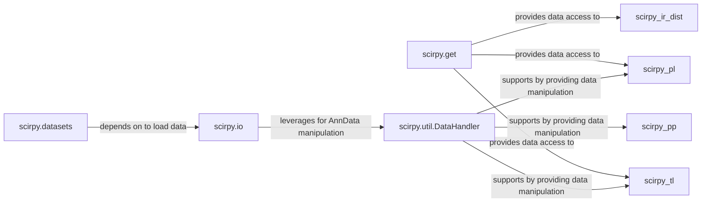

## Details

The I/O & Data Management component in scirpy is a foundational subsystem responsible for the entire lifecycle of immune receptor data, from ingestion to consistent access and manipulation within the central AnnData object. It adheres to the "Data-Centric Design" and "Modular Architecture" patterns, ensuring data integrity and seamless integration with other scirpy modules.

### scirpy.io

This is the primary entry point for ingesting raw immune receptor data from diverse external formats (e.g., 10x VDJ, AIRR) and converting it into the AnnData object. It handles the complexities of parsing, validating, and structuring the data according to scirpy's internal schema and the AIRR (Adaptive Immune Receptor Repertoire) standard.

**Related Classes/Methods**:

- <a href="https://github.com/scverse/scirpy/blob/main/src/scirpy/io/_io.py" target="_blank" rel="noopener noreferrer">`scirpy.io._io`</a>

- <a href="https://github.com/scverse/scirpy/blob/main/src/scirpy/io/_convert_anndata.py" target="_blank" rel="noopener noreferrer">`scirpy.io._convert_anndata`</a>

- <a href="https://github.com/scverse/scirpy/blob/main/src/scirpy/io/_datastructures.py" target="_blank" rel="noopener noreferrer">`scirpy.io._datastructures`</a>

- <a href="https://github.com/scverse/scirpy/blob/main/src/scirpy/io/_legacy.py" target="_blank" rel="noopener noreferrer">`scirpy.io._legacy`</a>

- <a href="https://github.com/scverse/scirpy/blob/main/src/scirpy/io/_util.py" target="_blank" rel="noopener noreferrer">`scirpy.io._util`</a>

### scirpy.get

This module provides a consistent, validated, and safe API for retrieving specific immune receptor (IR) related data fields from the AnnData object. It acts as a facade, abstracting away the internal complexities of AnnData for common IR-related queries, ensuring that downstream analysis and plotting functions receive data in the expected format and that data integrity is maintained.

**Related Classes/Methods**:

- `scirpy.get`

### scirpy.datasets

This component offers access to curated, pre-processed immune receptor datasets. While not directly involved in raw data ingestion from user files, it serves as a crucial part of the data management lifecycle by providing readily available, validated data for examples, testing, and benchmarking. It often leverages scirpy.io internally to load these datasets.

**Related Classes/Methods**:

- `scirpy.datasets`

### scirpy.util.DataHandler

This utility class (or set of functions within scirpy.util) provides a robust interface for low-level interactions with the AnnData object. It centralizes common data manipulation tasks, such as injecting parameter documentation, retrieving observation data (.obs), and setting observation data, thereby simplifying data access and ensuring data integrity and consistency for all analysis functions across scirpy.

**Related Classes/Methods**:

- `scirpy.util._data`

### [FAQ](https://github.com/CodeBoarding/GeneratedOnBoardings/tree/main?tab=readme-ov-file#faq)