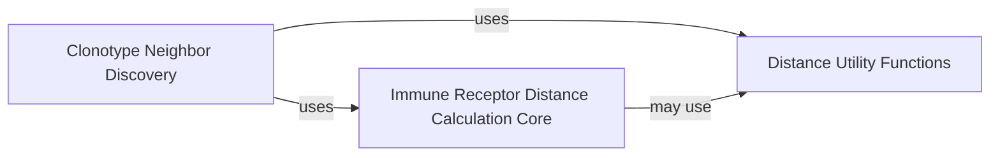

## Details

The `Immune Receptor Distance Calculation` subsystem provides essential functionality for quantifying the similarity between immune receptor sequences, emphasizing modularity, performance, and clear API boundaries. It includes core algorithms, neighbor discovery, and utility functions to support clonotype analysis.

### Immune Receptor Distance Calculation Core

This component provides the foundational algorithms and infrastructure for computing various sequence-based distances between immune receptors. It includes a base `DistanceCalculator` and specialized implementations for different metrics (e.g., Hamming, Levenshtein, Alignment, TCRdist, Identity), often leveraging parallelization for performance.

**Related Classes/Methods**:

- `DistanceCalculator` (1:1)

- `ParallelDistanceCalculator` (1:1)

- `HammingDistanceCalculator` (1:1)

- `LevenshteinDistanceCalculator` (1:1)

- `AlignmentDistanceCalculator` (1:1)

- `TCRdistDistanceCalculator` (1:1)

- `IdentityDistanceCalculator` (1:1)

- `_MetricDistanceCalculator` (1:1)

### Clonotype Neighbor Discovery

This component is responsible for identifying and managing neighboring immune receptors or clonotypes based on the distances computed by the `Immune Receptor Distance Calculation Core`. It translates raw distance metrics into meaningful relationships, which are crucial for downstream clonotype analysis.

**Related Classes/Methods**:

- `ClonotypeNeighbors` (1:1)

### Distance Utility Functions

This component provides helper functions and specialized utilities that support the distance calculation and neighbor discovery processes. These utilities often focus on optimizing performance or facilitating efficient data handling within the `ir_dist` module.

**Related Classes/Methods**:

- `DoubleLookupNeighborFinder` (1:1)

### [FAQ](https://github.com/CodeBoarding/GeneratedOnBoardings/tree/main?tab=readme-ov-file#faq)