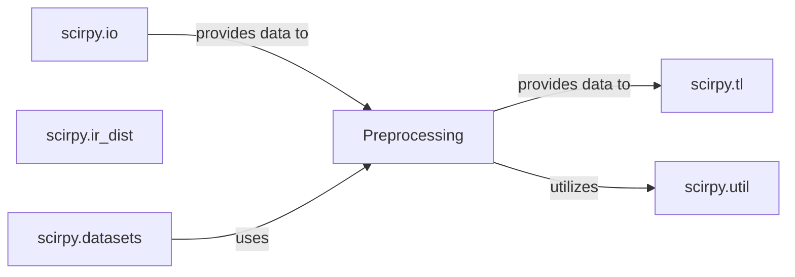

## Details

One paragraph explaining the functionality which is represented by this graph. What the main flow is and what is its purpose.

### Preprocessing [[Expand]](./Preprocessing.md)

This component is responsible for transforming raw or loaded immune receptor data into a standardized and analysis-ready format, primarily within AnnData objects. Its core functions include `index_chains` for structuring and validating chain information and `merge_adata` for combining multiple AnnData objects. This ensures data quality and consistency across the entire analysis pipeline.

**Related Classes/Methods**:

### scirpy.io

Handles loading and saving of immune receptor data.

**Related Classes/Methods**: _None_

### scirpy.tl

Provides tools for various analytical tasks on immune receptor data.

**Related Classes/Methods**: _None_

### scirpy.util

Contains utility functions used across the scirpy library.

**Related Classes/Methods**: _None_

### scirpy.ir_dist

Calculates immune receptor distances.

**Related Classes/Methods**: _None_

### scirpy.datasets

Provides example datasets for scirpy.

**Related Classes/Methods**: _None_

### [FAQ](https://github.com/CodeBoarding/GeneratedOnBoardings/tree/main?tab=readme-ov-file#faq)