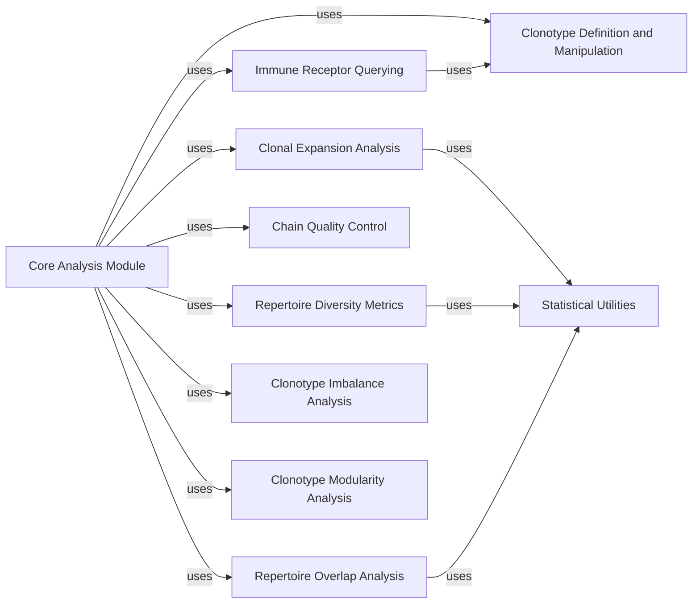

## Details

Abstract Components Overview

### Core Analysis Module

This is the main entry point for repertoire analysis functions. It provides a high-level API for users to perform various analytical tasks. It orchestrates calls to specialized sub-modules for specific analyses.

**Related Classes/Methods**:

- `scirpy.tl` (1:1)

### Clonotype Definition and Manipulation

This component is responsible for defining and manipulating clonotypes based on various criteria (e.g., CDR3 sequences, V/J genes). It provides functions for grouping cells into clonotypes and managing clonotype-related metadata.

**Related Classes/Methods**:

- <a href="https://github.com/scverse/scirpy/blob/main/src/scirpy/tl/_clonotypes.py#L1-L1" target="_blank" rel="noopener noreferrer">`scirpy.tl._clonotypes` (1:1)</a>

### Clonal Expansion Analysis

This component focuses on analyzing the expansion of specific clonotypes within a repertoire. It provides functions to quantify clonal expansion and identify highly expanded clones.

**Related Classes/Methods**:

- <a href="https://github.com/scverse/scirpy/blob/main/src/scirpy/tl/_clonal_expansion.py#L1-L1" target="_blank" rel="noopener noreferrer">`scirpy.tl._clonal_expansion` (1:1)</a>

### Repertoire Diversity Metrics

This component calculates various diversity metrics to characterize the richness and evenness of immune repertoires.

**Related Classes/Methods**:

- <a href="https://github.com/scverse/scirpy/blob/main/src/scirpy/tl/_diversity.py#L1-L1" target="_blank" rel="noopener noreferrer">`scirpy.tl._diversity` (1:1)</a>

### Repertoire Overlap Analysis

This component quantifies the overlap between different immune repertoires, allowing for comparisons between samples or conditions.

**Related Classes/Methods**:

- <a href="https://github.com/scverse/scirpy/blob/main/src/scirpy/tl/_repertoire_overlap.py#L1-L1" target="_blank" rel="noopener noreferrer">`scirpy.tl._repertoire_overlap` (1:1)</a>

### Chain Quality Control

This component provides functions for performing quality control on immune receptor chains, identifying and flagging potential issues or inconsistencies in the data.

**Related Classes/Methods**:

- <a href="https://github.com/scverse/scirpy/blob/main/src/scirpy/tl/_chain_qc.py#L1-L1" target="_blank" rel="noopener noreferrer">`scirpy.tl._chain_qc` (1:1)</a>

### Immune Receptor Querying

This component enables querying and filtering immune receptor data based on various criteria, facilitating targeted analysis of specific receptors or clonotypes.

**Related Classes/Methods**:

- <a href="https://github.com/scverse/scirpy/blob/main/src/scirpy/tl/_ir_query.py#L1-L1" target="_blank" rel="noopener noreferrer">`scirpy.tl._ir_query` (1:1)</a>

### Statistical Utilities

This component provides general statistical utility functions that are commonly used across various analytical tasks within scirpy.tl.

**Related Classes/Methods**:

- `scirpy.util` (1:1)

### Clonotype Imbalance Analysis

This component analyzes the imbalance of clonotypes, often in the context of different groups or conditions, to identify shifts in repertoire composition.

**Related Classes/Methods**:

- <a href="https://github.com/scverse/scirpy/blob/main/src/scirpy/tl/_clonotype_imbalance.py#L1-L1" target="_blank" rel="noopener noreferrer">`scirpy.tl._clonotype_imbalance` (1:1)</a>

### Clonotype Modularity Analysis

This component investigates the modular structure of clonotypes, potentially identifying groups of clonotypes that co-occur or share characteristics.

**Related Classes/Methods**:

- <a href="https://github.com/scverse/scirpy/blob/main/src/scirpy/tl/_clonotype_modularity.py#L1-L1" target="_blank" rel="noopener noreferrer">`scirpy.tl._clonotype_modularity` (1:1)</a>

### [FAQ](https://github.com/CodeBoarding/GeneratedOnBoardings/tree/main?tab=readme-ov-file#faq)