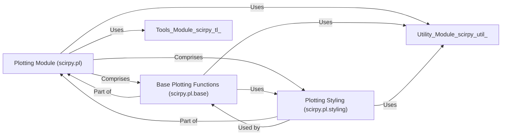

## Details

The `scirpy.pl` package, as a specialized scientific computing library, is designed with a clear modular architecture, focusing on data visualization. These components are fundamental because they represent a clear separation of concerns within the visualization subsystem, aligning with the "Modular Architecture" and "Facade Pattern" principles.

### Plotting Module (scirpy.pl)

This is the top-level module for all visualization functionalities. It acts as a facade, providing high-level functions for generating various plots related to IR-seq data. It orchestrates calls to lower-level plotting primitives and styling utilities, ensuring a consistent and user-friendly interface for data visualization.

**Related Classes/Methods**:

- <a href="https://github.com/scverse/scirpy/blob/main/src/scirpy/pl/__init__.py#L1-L1" target="_blank" rel="noopener noreferrer">`scirpy/pl/__init__.py` (1:1)</a>

- <a href="https://github.com/scverse/scirpy/blob/main/src/scirpy/pl/_clonal_expansion.py#L1-L1" target="_blank" rel="noopener noreferrer">`scirpy/pl/_clonal_expansion.py` (1:1)</a>

- <a href="https://github.com/scverse/scirpy/blob/main/src/scirpy/pl/_clonotype_imbalance.py#L1-L1" target="_blank" rel="noopener noreferrer">`scirpy/pl/_clonotype_imbalance.py` (1:1)</a>

- <a href="https://github.com/scverse/scirpy/blob/main/src/scirpy/pl/_clonotype_modularity.py#L1-L1" target="_blank" rel="noopener noreferrer">`scirpy/pl/_clonotype_modularity.py` (1:1)</a>

- <a href="https://github.com/scverse/scirpy/blob/main/src/scirpy/pl/_clonotypes.py#L1-L1" target="_blank" rel="noopener noreferrer">`scirpy/pl/_clonotypes.py` (1:1)</a>

- <a href="https://github.com/scverse/scirpy/blob/main/src/scirpy/pl/_diversity.py#L1-L1" target="_blank" rel="noopener noreferrer">`scirpy/pl/_diversity.py` (1:1)</a>

- <a href="https://github.com/scverse/scirpy/blob/main/src/scirpy/pl/_group_abundance.py#L1-L1" target="_blank" rel="noopener noreferrer">`scirpy/pl/_group_abundance.py` (1:1)</a>

- <a href="https://github.com/scverse/scirpy/blob/main/src/scirpy/pl/_logoplots.py#L1-L1" target="_blank" rel="noopener noreferrer">`scirpy/pl/_logoplots.py` (1:1)</a>

- <a href="https://github.com/scverse/scirpy/blob/main/src/scirpy/pl/_repertoire_overlap.py#L1-L1" target="_blank" rel="noopener noreferrer">`scirpy/pl/_repertoire_overlap.py` (1:1)</a>

- <a href="https://github.com/scverse/scirpy/blob/main/src/scirpy/pl/_spectratype.py#L1-L1" target="_blank" rel="noopener noreferrer">`scirpy/pl/_spectratype.py` (1:1)</a>

- <a href="https://github.com/scverse/scirpy/blob/main/src/scirpy/pl/_vdj_usage.py#L1-L1" target="_blank" rel="noopener noreferrer">`scirpy/pl/_vdj_usage.py` (1:1)</a>

### Base Plotting Functions (scirpy.pl.base)

This sub-module provides fundamental, reusable plotting primitives. These functions are the building blocks for more complex and specialized visualizations within the `scirpy.pl` module. They ensure consistency in basic plot types (e.g., bar, line, scatter) across the library.

**Related Classes/Methods**:

- <a href="https://github.com/scverse/scirpy/blob/main/src/scirpy/pl/base.py#L1-L1" target="_blank" rel="noopener noreferrer">`scirpy/pl/base.py` (1:1)</a>

### Plotting Styling (scirpy.pl.styling)

This sub-module centralizes all styling parameters, color palettes, and functions. Its purpose is to ensure a uniform and high-quality aesthetic for all plots generated by `scirpy.pl`, which is crucial for scientific publications and presentations.

**Related Classes/Methods**:

- <a href="https://github.com/scverse/scirpy/blob/main/src/scirpy/pl/styling.py#L1-L1" target="_blank" rel="noopener noreferrer">`scirpy/pl/styling.py` (1:1)</a>

### [FAQ](https://github.com/CodeBoarding/GeneratedOnBoardings/tree/main?tab=readme-ov-file#faq)