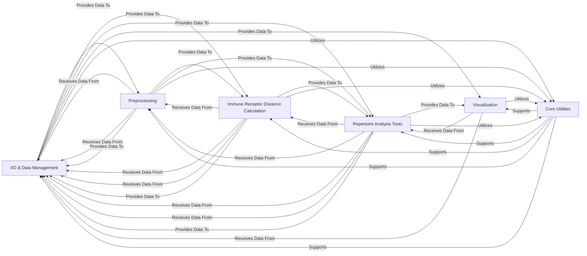

## Details

The `scirpy` library, designed as a Specialized Scientific Computing Library/Bioinformatics Toolkit, exhibits a modular and data-centric architecture, with the AnnData object serving as the central data container. The system is structured around six core components, each with distinct responsibilities and clear interaction patterns, facilitating a robust and extensible framework for immune repertoire analysis.

### I/O & Data Management [[Expand]](./I_O_Data_Management.md)

This foundational component is responsible for the entire lifecycle of immune receptor data. It handles the ingestion of raw data from diverse formats (e.g., 10x VDJ, AIRR) into the central AnnData object, manages schema compatibility, and provides a consistent, validated API for accessing and manipulating data within AnnData. It acts as the primary interface for data persistence and retrieval.

**Related Classes/Methods**:

- `scirpy.datasets` (0:1)

- `scirpy.io` (0:1)

- `scirpy.util.DataHandler` (0:1)

- `scirpy.get` (0:1)

### Preprocessing [[Expand]](./Preprocessing.md)

This component prepares raw or loaded immune receptor data for downstream analysis. Its key functions include indexing chains within the AnnData object to ensure proper structure and merging multiple AnnData objects for combined analysis, ensuring data readiness and consistency.

**Related Classes/Methods**:

- `scirpy.pp` (0:1)

### Immune Receptor Distance Calculation [[Expand]](./Immune_Receptor_Distance_Calculation.md)

This specialized component implements various algorithms for calculating sequence-based distances between immune receptor sequences (e.g., CDR3s). It computes distance matrices and identifies clonotype neighbors based on these metrics, often leveraging performance optimizations like parallelization.

**Related Classes/Methods**:

- `scirpy.ir_dist` (0:1)

### Repertoire Analysis Tools [[Expand]](./Repertoire_Analysis_Tools.md)

This is the core analytical engine of the library, offering a comprehensive suite of tools for in-depth analysis of immune repertoires. Functions include defining clonotypes, analyzing clonal expansion, assessing diversity, quantifying repertoire overlap, and performing quality control on chains.

**Related Classes/Methods**:

- `scirpy.tl` (0:1)

### Visualization [[Expand]](./Visualization.md)

This component is dedicated to generating various plots that visualize repertoire characteristics and the results of analyses. It includes base plotting utilities and styling functions to ensure consistent and high-quality visualizations, aiding in exploratory data analysis and presentation.

**Related Classes/Methods**:

- `scirpy.pl` (0:1)

### Core Utilities [[Expand]](./Core_Utilities.md)

This foundational component provides common helper functions used across the entire library. This includes utilities for documentation injection, data type checks, sequence translation, parallelization, various mathematical helpers, and functionalities for graph creation, manipulation, and layout algorithms, particularly for clonotype networks. It acts as a support layer for all other components.

**Related Classes/Methods**:

- `scirpy.util` (0:1)

### [FAQ](https://github.com/CodeBoarding/GeneratedOnBoardings/tree/main?tab=readme-ov-file#faq)