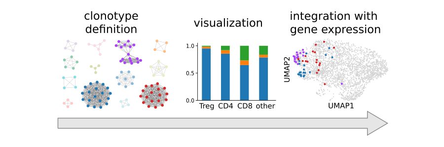

Scirpy: A Scanpy extension for analyzing single-cell immune-cell receptor sequencing data
=========================================================================================
|tests| |docs| |pypi| |bioconda| |airr| |black|

.. |tests| image:: https://github.com/icbi-lab/scirpy/workflows/tests/badge.svg
    :target: https://github.com/icbi-lab/scirpy/actions?query=workflow%3Atests
    :alt: Build Status

.. |docs| image::  https://github.com/icbi-lab/scirpy/workflows/docs/badge.svg
    :target: https://icbi-lab.github.io/scirpy/latest
    :alt: Documentation Status

.. |pypi| image:: https://img.shields.io/pypi/v/scirpy?logo=PyPI
    :target: https://pypi.org/project/scirpy/
    :alt: PyPI

.. |bioconda| image:: https://img.shields.io/badge/install%20with-bioconda-brightgreen.svg?style=flat
     :target: http://bioconda.github.io/recipes/scirpy/README.html
     :alt: Bioconda

.. |black| image:: https://img.shields.io/badge/code%20style-black-000000.svg
    :target: https://github.com/psf/black
    :alt: The uncompromising python formatter

.. |airr| image:: https://img.shields.io/static/v1?label=AIRR-C%20sw-tools%20v1&message=compliant&color=008AFF&labelColor=000000&style=flat)
    :target: https://docs.airr-community.org/en/stable/swtools/airr_swtools_standard.html
    :alt: AIRR-compliant

Scirpy is a scalable python-toolkit to analyse T cell receptor (TCR) or B cell receptor (BCR)
repertoires from single-cell RNA sequencing (scRNA-seq) data. It seamlessly integrates with the popular
`scanpy <https://scanpy.readthedocs.io/en/stable/index.html>`_ library and
provides various modules for data import, analysis and visualization.

Getting started
^^^^^^^^^^^^^^^
Please refer to the `documentation <https://icbi-lab.github.io/scirpy/latest>`_. In particular, the

- `Tutorial <https://icbi-lab.github.io/scirpy/latest/tutorials/tutorial_3k_tcr.html>`_, and the
- `API documentation <https://icbi-lab.github.io/scirpy/latest/api.html>`_.

In the documentation, you can also learn more about our `immune-cell receptor model <https://icbi-lab.github.io/scirpy/latest/ir-biology.html>`_.

Case-study
~~~~~~~~~~
The case study from our preprint is available `here <https://icbi-lab.github.io/scirpy-paper/wu2020.html>`_.

Installation
^^^^^^^^^^^^
You need to have Python 3.7 or newer installed on your system. If you don't have
Python installed, we recommend installing `Miniconda <https://docs.conda.io/en/latest/miniconda.html>`_.

There are several alternative options to install scirpy:

1) Install the latest release of `scirpy` from `PyPI <https://pypi.org/project/scirpy/>`_:

.. code-block::

    pip install scirpy

2) Get it from `Bioconda <http://bioconda.github.io/recipes/scirpy/README.html>`_:

.. code-block::

    conda install -c conda-forge -c bioconda scirpy

3) Install the latest development version:

.. code-block::

    pip install git+https://github.com/icbi-lab/scirpy.git@master

4) Run it in a container using `Docker <https://www.docker.com/>`_ or `Podman <https://podman.io/>`_:

.. code-block::

    docker pull quay.io/biocontainers/scirpy:<tag>

where `tag` is one of `these tags <https://quay.io/repository/biocontainers/scirpy?tab=tags>`_.

Support
^^^^^^^
We are happy to assist with problems when using scirpy. Please report any bugs,
feature requests, or help requests using the `issue tracker <https://github.com/icbi-lab/scirpy/issues>`_.
We try to respond within two working days, however fixing bugs or implementing new features
can take substantially longer, depending on the availability of our developers.

Release notes
^^^^^^^^^^^^^
See the `release section <https://github.com/icbi-lab/scirpy/releases>`_.

Contact
^^^^^^^
Please use the `issue tracker <https://github.com/icbi-lab/scirpy/issues>`_.

Citation
^^^^^^^^

    Sturm, G. Tamas, GS, ..., Finotello, F. (2020). Scirpy: A Scanpy extension for analyzing single-cell T-cell receptor sequencing data. Bioinformatics. doi:`10.1093/bioinformatics/btaa611 <https://doi.org/10.1093/bioinformatics/btaa611>`_
