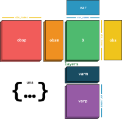

Data structure and usage principles
===================================

Using scirpy
------------

Import scirpy as

.. code-block:: python

   import scanpy as sc
   import scirpy as ir

As a scverse core package, scirpy adheres to the workflow principles
`laid out by scanpy <https://scanpy.readthedocs.io/en/stable/usage-principles.html>`_.:

* The :ref:`API <api>` is divided into *preprocessing* (`pp`), *tools* (`tl`), and *plotting* (`pl`).

* All functions work on :class:`~anndata.AnnData` or :class:`~mudata.MuData` objects.

* The :class:`~anndata.AnnData` instance is modified inplace, unless a function is called with the keyword argument `inplace=False`.

We decided to handle a few minor points differently to Scanpy:

* Plotting functions with inexpensive computations (e.g. :func:`scirpy.pl.clonal_expansion`) call the corresponding tool (:func:`scirpy.tl.clonal_expansion`) on-the-fly and don't store the results in the :class:`~anndata.AnnData` object.

* All plotting functions, by default, return a :class:`~matplotlib.axes.Axes` object, or a list of such.

.. _data-structure:

Storing AIRR rearrangement data in AnnData
------------------------------------------

For instructions how to load data into scirpy, see :ref:`importing-data`.

.. note::

    Scirpy's data structure was fundamentally changed in version 0.13.0. While previously, immune receptor
    data was expanded into columns in `adata.obs`, they are now stored as :term:`awkward array` in `adata.obsm`.
    The new data structure is explained below. For more information about the change, please refer to the
    corresponding :ref:`release notes <v0.13>`.

Scirpy combines the `AIRR Rearrangement standard <https://docs.airr-community.org/en/latest/datarep/rearrangements.html>`_
for representing adaptive immune receptor repertoire data with scverse's `AnnData <https://anndata.readthedocs.io/en/latest/>`_ data structure.

`AnnData`` combines a gene expression matrix (`.X`), gene-level annotations (`.var`) and
cell-level annotations (`.obs`) into a single object. Additionally, matrices aligned to the cells can be stored in `.obsm`.

The AIRR rearrangement standard defines a set of fields to describe single receptor chains. One cell can have
multiple receptor chains. This relationship is represented as an :term:`awkward array` stored in `adata.obsm["airr"]`.

The first dimension of the array represents the cells and is aligned to the `obs` axis of the `AnnData` object.
The second dimension represents the number of chains per cell and is of variable length. The third dimension
is a :ref:~akward.RecordType` and represents fields defined in the rearrangement standard.

.. code-block:: python

    # adata.obsm["airr"]
    [
        # cell0: 2 chains
        [
            {"locus": "TRA", "junction_aa": "CADASGT..."},
            {"locus": "TRB", "junction_aa": "CTFDD..."},
        ],
        # cell1: 1 chain
        [{"locus": "IGH", "junction_aa": "CDGFFA..."}],
        # cell2: 0 chains
        [],
    ]

This allows to losslessly store a complete AIRR rearrangement table in AnnData. The purpose of scirpy's :ref:`IO module <api-io>`
is to create AnnData objects with the corresponding `obsm` entries. At this point, chains are neither filtered, nor separated by locus.
This allows any scverse ecosystem package working with AIRR data to adopt the datastructure and to reuse scirpy's IO functions
if they use :ref:`scirpy's receptor model <receptor-model>` or not.

.. _chain-indices:

Chain indices
-------------
The :ref:`scirpy receptor model <receptor-model>` allows up to two pairs of chains per cell. This representation
requires separation of chains by :term:`locus <Chain locus>` into :term:`VJ <V(D)J>` and :term:`VDJ <V(D)J>` chains,
and (optionally) filtering non-productive chains.

The :func:`~scirpy.pp.index_chains` function serves for this purpose. It creates an additional :term:`awkward array`
in `adata.obsm` that has the following structure:

.. code-block:: python

    # adata.obsm["chain_indices"]
    [
        # cell0:
        #   * 1 VJ chain which is at index 0 in `adata.obsm["airr"][0]`
        #   * 1 VDJ chain which is at in dex 1 in `adata.obsm["airr"][0]`
        #   * multichain = False, because the chains does not have more than 2 VJ or VDJ chains
        {"VJ": [0], "VDJ": [1], "multichain": False},  # single pair
        # cell1:
        #   * primary VJ chain is at index 0 in `adata.obsm["airr"][1]`
        #   * secondary VJ chain is at index 2 in `adata.obsm["airr"][1]`
        #   * etc.
        {"VJ": [0, 2], "VDJ": [1, 3], "multichain": False},  # dual IR
    ]

The `obsm["chain_indices"]` array could easily be adapted to other receptor models. For instance,
a library working with spatial :term:`TCR` data where each entry in `obs` corresponds to a "spot" with multiple cells rather
than a single cell could have a list with an arbitrary number of indices for the `"VJ"` and `"VDJ"` entries, respectively.
By using a different function for chain indexing, it would also be very straightforward to support non-IMGT loci (e.g.
from other species).

.. _accessing-airr-data:

Accessing AIRR data
-------------------
Any scirpy function accessing AIRR data uses these indices in `adata.obsm["chain_indices"]` to subset the awkward array in
`adata.obsm["airr"]`. To retreive AIRR data convenientely, we added the :func:`scirpy.get.airr` function. It allows
to specify one or multiple fields and chains and returns a :class:`pandas.Series` or :class:`pandas.DataFrame`, respectively:

.. code-block:: pycon

    # retrieve the "locus" field of the primary VJ chain for each cell
    >>> ir.get.airr(adata, "locus", "VJ_1")
    AAACCTGAGAGTGAGA-1     TRA
    AAACCTGAGGCATTGG-1     TRA
    AAACCTGCACCTCGTT-1    None
    ...

By using the :func:`~scirpy.get.airr_context` context manager, fields can be temporarily added to the `adata.obs`
and used, e.g. for plotting:

.. code-block:: python

    with ir.get.airr_context(adata, "locus", "VJ_1"):
        sc.pl.umap(adata, color="VJ_1_locus")

.. _multimodal-data:

Working with multimodal data
----------------------------

The recommended way of working with paired gene expression (GEX) and AIRR data is to use the
`MuData <https://muon.readthedocs.io/en/latest/notebooks/quickstart_mudata.html>`_ container. `MuData` manages
multiple `AnnData` objects that share observations and/or features.

After reading in AIRR data with the scirpy :ref:`IO module <api-io>` and gene expression data with scanpy,
they can be merged in a `MuData` object. For instance:

.. code-block:: python

    adata_airr = ir.io.read_10x_vdj("all_contig_annotations.json")
    adata_gex = sc.read_10x_h5("filtered_feature_bc_matrix.h5")
    mdata = MuData({"airr": adata_airr, "gex": adata_gex})

Scirpy functions can be applied directly to the MuData object. By default, it will retrieve AIRR data from the `"airr"`
modality.

.. code-block:: python

    ir.tl.chain_qc(mdata)

All functions updating `obs` inplace update both `mdata.obs[f"airr:{key_added}"]` and `mata.mod["airr"].obs[key_added]`.
This means you usually do not need to call :py:meth:`mdata.update() <mudata.MuData.update>` after running a scirpy function.

Should you prefer to not use MuData, this is entirely possible. All scirpy functions work as well on a single
`AnnData` object that contains gene expression data in `adata.X` and AIRR data in `adata.obsm["airr"]`.
Here is one way how the AIRR data can be merged into an AnnData object that already contains gene expression data:

.. code-block:: python

    # Map each cell barcode to its respective numeric index (assumes obs_names are unique)
    barcode2idx = {barcode: i for i, barcode in enumerate(adata_airr.obs_names)}
    # Generate a slice for the awkward array that retrieves the corresponding row
    # from `adata_airr` for each barcode in `adata_gex`. `-1` will generate all
    # "None"s for barcodes that are not in `adata_airr`
    idx = [barcode2idx.get(barcode, -1) for barcode in adata_gex.obs_names]
    adata_gex.obsm["airr"] = adata_airr.obsm["airr"][idx]

Common function parameters
--------------------------
Wherever applicable, scirpy's functions take the following arguments:

* `airr_mod` specifies the slot in `MuData` that contains the `AnnData` object with AIRR data. This parameter is ignored when working with AnnData directly. Defaults to `"airr"`.

* `airr_key` specifies the slot in `AnnData.obsm` that contains the awkward array with AIRR data. Defaults to `"airr"`.

* `chain_idx_key` specifies the slot in `AnnData.obsm` thtat contains the chain indices. Defaults to `"chain_indices"`.

* `inplace` defines if a function stores its results back in the AnnData/MuData object or returns them.

* `key_added` defines the key (e.g. in `.obs`) where a function's result is stored if `inplace=True`.

The :class:`~scirpy.util.DataHandler` class ensures that these parameters are handled consistently across functions.

**For most use cases you can stick to the default and do not need to modify these parameters.**
