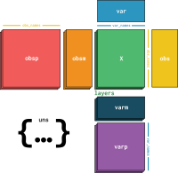

Usage principles
=========================

Import scirpy as 

.. code-block:: python

   import scanpy as sc   
   import scirpy as ir

Workflow
--------
Scirpy is an extension to `Scanpy <https://scanpy.readthedocs.io>`_ and adheres to its
`workflow principles <https://scanpy.readthedocs.io/en/stable/usage-principles.html>`_:

 * The :ref:`API <API>` is divided into *preprocessing* (`pp`), *tools* (`tl`),
   and *plotting* (`pl`). 
 * All functions work on :class:`~anndata.AnnData` objects. 
 * The :class:`~anndata.AnnData` instance is modified inplace, unless the functions
   is called with the keyword argument `inplace=False`. 

We decided to handle a few minor points differenlty to Scanpy:

 * Plotting functions with inexpensive computations (e.g. :func:`scirpy.pl.clonal_expansion`)
   call the corresponding tool (:func:`scirpy.tl.clonal_expansion`) on-the-fly and
   don't store the results in the :class:`~anndata.AnnData` object. 
 * All plotting functions, by default, return a :class:`~matplotlib.axes.Axes` object, 
   or a list of such. 

.. _data-structure:

Data structure
--------------

For instructions how to load data into scirpy, see :ref:`importing-data`.

Scirpy leverages the `AnnData <https://github.com/theislab/anndata>`_ data structure
which combines a gene expression matrix (`.X`), gene-level annotations (`.var`) and 
cell-level annotations (`.obs`) into a single object. :class:`~anndata.AnnData` forms the basis for the 
`Scanpy analysis workflow <https://scanpy.readthedocs.io/en/stable/usage-principles.html>`_ 
for single-cell transcriptomics data. 

   Image by `F. Alex Wolf <http://falexwolf.de/>`__.

Scirpy adds the following TCR-related columns to `AnnData.obs`: 

 * `has_tcr`: `True` for all cells with a T-cell receptor
 * `TRA_1_<attr>`/`TRA_2_<attr>`: columns related to the primary and secondary TCR-alpha chain
 * `TRB_1_<attr>`/`TRB_2_<attr>`: columns related to the primary and secondary TCR-beta chain

Where `<attr>` is any of:

 * `c_gene`, `v_gene`, `d_gene`, `j_gene`: The gene symbols of the respective genes
 * `cdr3` and `cdr3_nt`: The amino acoid and nucleotide sequences of the CDR3 regions
 * `junction_ins`: The number of nucleotides inserted in the `VD` + `DJ` junctions or the `VJ` junction, respectively. 